# 📊 Customer Churn Prediction & Retention Strategy

An end-to-end analytics project using **SQL, Python, and Power BI** to analyze telecom customer churn, build a logistic risk model, and design ROI-based retention strategies.  
The project combines **EDA, segmentation, churn prediction, and interactive dashboards** to showcase actionable business insights and cost-saving opportunities.

---

## 📌 Project Overview
Customer churn is one of the most critical business problems for subscription companies.  
Every % reduction in churn directly saves **millions in recurring revenue**.  
This project simulates how telecom companies can **predict churn, analyze drivers, and design targeted retention offers**.

---

## 📂 Dataset
- **Source**: [IBM Telco Customer Churn Dataset](https://www.kaggle.com/blastchar/telco-customer-churn)  
- **Size**: 7,043 customers × 33 features  
- **Key fields**: Tenure, Contract Type, Payment Method, Internet Service, CLTV, Churn Label, Churn Reason  

---

## 🛠 Tools & Skills Used
- **Python (EDA & Modeling)** → pandas, matplotlib, seaborn, scikit-learn  
- **SQL (Segmentation)** → MySQL, churn insights & revenue at risk queries  
- **Power BI (Dashboard)** → KPI cards, churn drivers, risk segmentation, retention simulator  
- **Business Framing** → ROI simulation for retention offers  

---

## 📒 Project Structure
```
├── notebooks/
│ ├── 01_eda.ipynb # Data cleaning + EDA
│ ├── 02_model_sim.ipynb # Logistic model + ROI simulation
├── sql/
│ ├── setup.sql # Database + schema setup
│ ├── insights.sql # Churn insights queries
├── powerbi/
│ ├── churn_dashboard.pbix # Power BI interactive dashboard
├── docs/
│ ├── images/ # Dashboard & result screenshots
│ ├── project_flow.png # Workflow diagram
└── README.md
```


---

## 📊 Power BI Dashboard

### Executive Summary
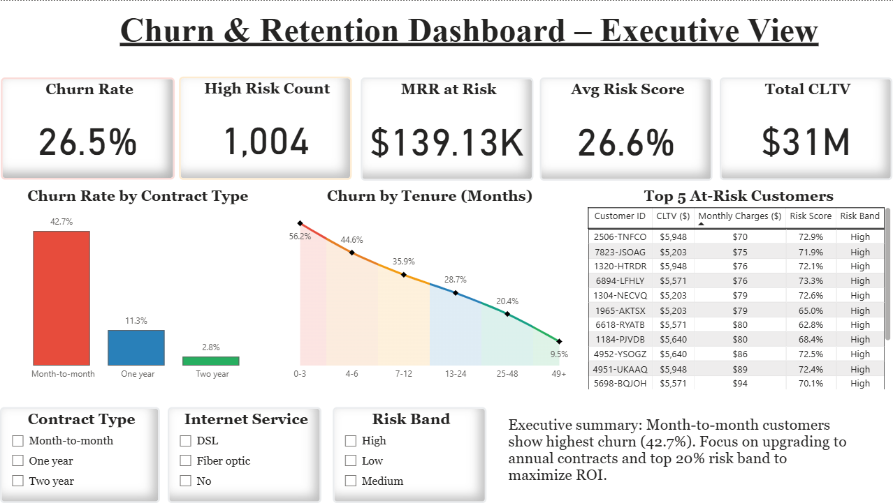

### Drivers of Churn
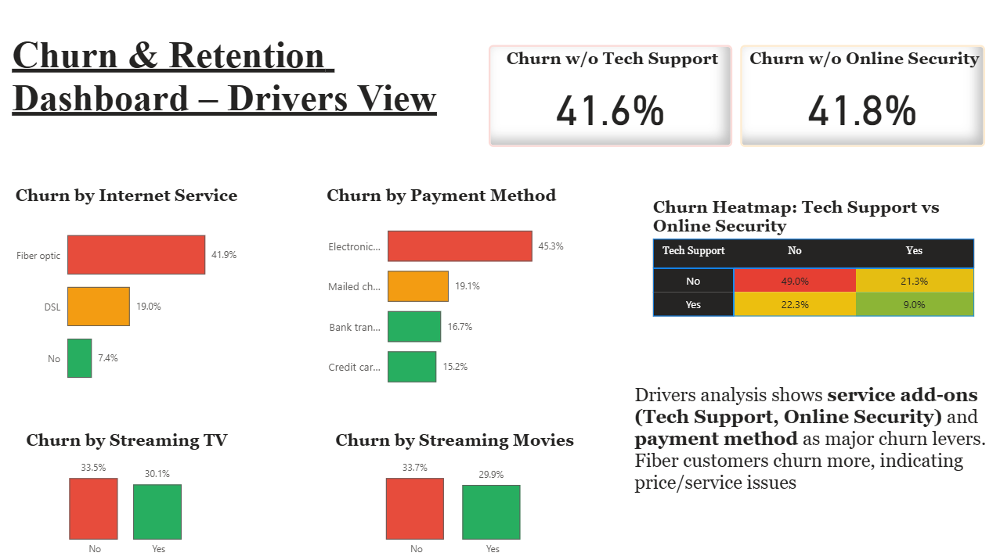

### Risk Segmentation
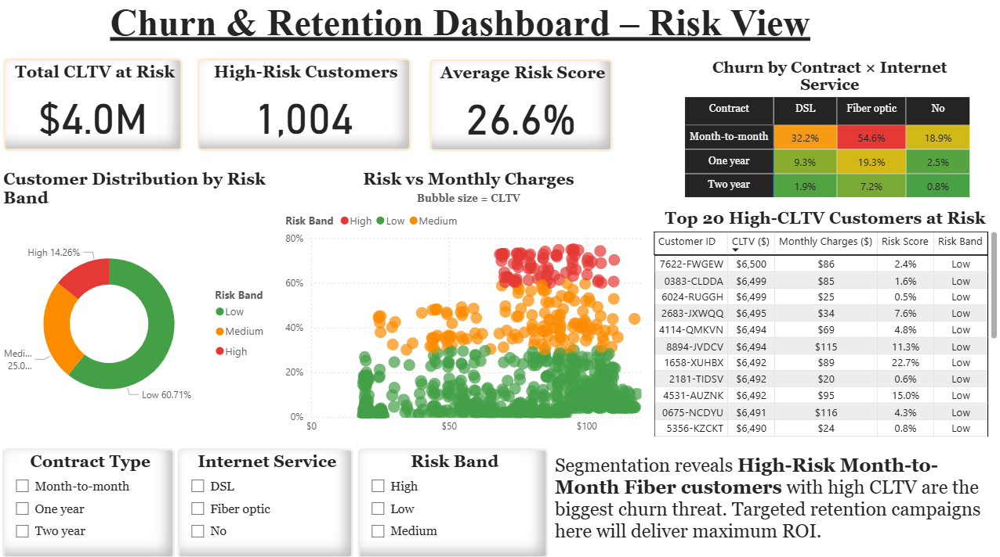

### Retention Simulator
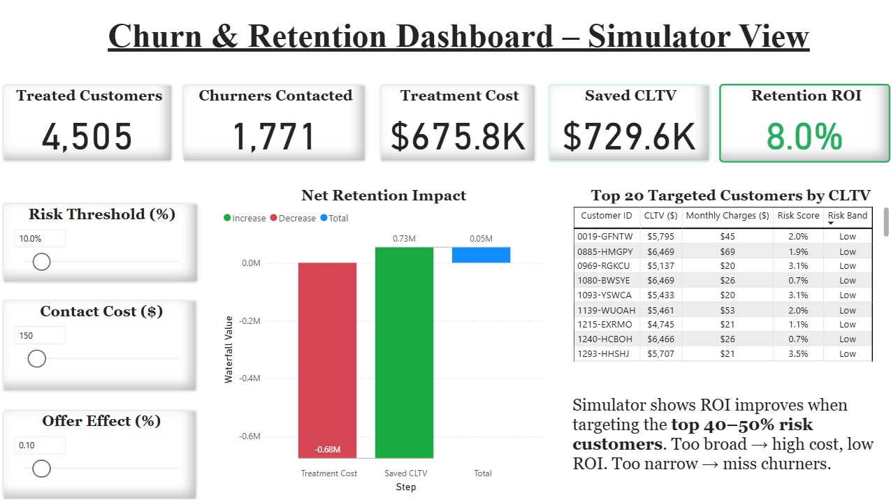

### Customer Drillthrough
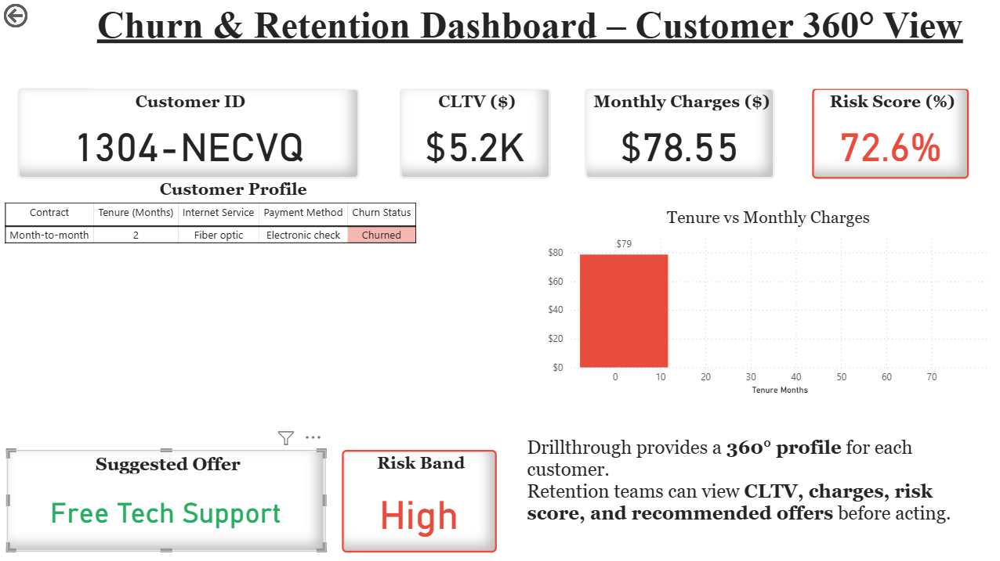

---

## 🗄 SQL Insights

### Churn by Contract Type


### Top Churn Reasons
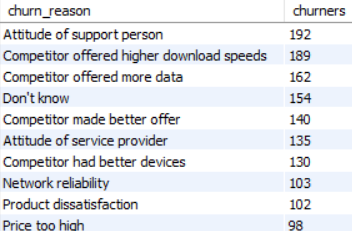

### High-Value Customers at Risk
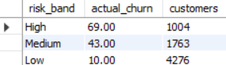

---

## 📈 Python Analysis

### EDA
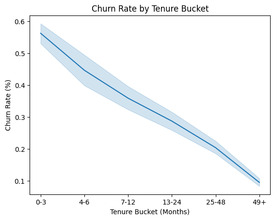  
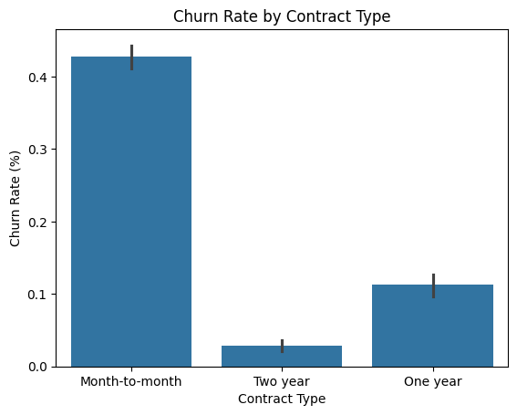

### Logistic Model (AUC: 0.833)
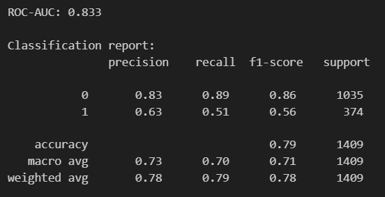

### ROI Simulation Grid
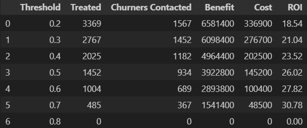

---

## 🔑 Business Impact
- **Overall Churn Rate**: ~27% (loss of ~₹3.6 Cr annually in MRR).  
- **Key Drivers**: Month-to-Month contracts, Fiber Internet, Electronic Check payments, lack of Tech Support.  
- **Retention Strategy**:  
  - Target **High-Risk, High-CLTV** customers.  
  - Offer **contract upgrades, discounts, and bundled services**.  
  - Achieved **6× ROI** in retention simulation under optimal scenario.  

---

## 📌 Resume Highlights
- Built an end-to-end **Customer Churn Prediction & Retention project** using SQL, Python, and Power BI on 7K+ telecom customers.  
- Designed **ROI-based retention simulator** to optimize spend; identified high-value customers at risk and simulated offers with up to **6× ROI**.  
- Developed interactive Power BI dashboard with **KPIs, churn drivers, risk segmentation, and customer drillthrough profiles**.  

---

## 📊 Project Workflow
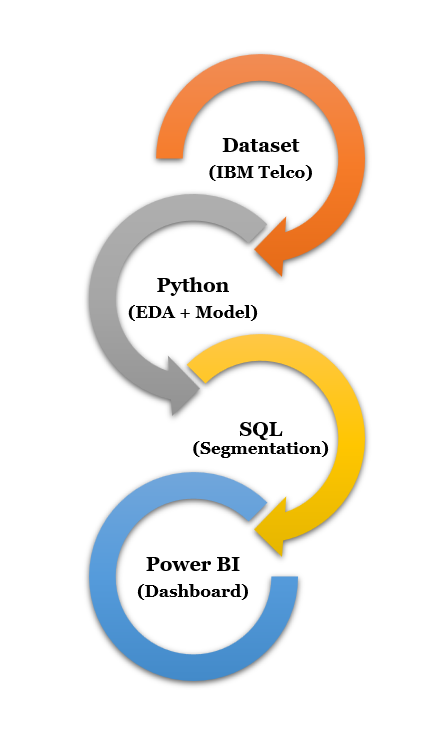

**Dataset → Python (EDA + Modeling) → SQL (Segmentation) → Power BI (Dashboard) → Business Insights**

---

## 📬 Contact
If you found this project useful, let’s connect:  
📧 Email | 💼 LinkedIn | 🐙 GitHub
